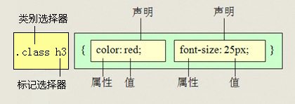

# 1. CSS初识

* 概念：CSS(Cascading Style Sheets)  ，通常称为CSS样式表或层叠样式表（级联样式表）
* 作用：
  * 主要用于**设置** HTML页面中的文本内容（字体、大小、对齐方式等）、图片的外形（宽高、边框样式、边距等）以及**版面的布局和外观显示样式。**
  * CSS以HTML为基础，提供了丰富的功能，如字体、颜色、背景的控制及整体排版等，而且还可以针对不同的浏览器设置不同的样式。

# 2. 引入CSS样式表

| 样式表     | 优点                     | 缺点                     | 使用情况       | 控制范围           |
| ---------- | ------------------------ | ------------------------ | -------------- | ------------------ |
| 行内样式表 | 书写方便，权重高         | 没有实现样式和结构相分离 | 较少           | 控制一个标签（少） |
| 内部样式表 | 部分结构和样式相分离     | 没有彻底分离             | 较多           | 控制一个页面（中） |
| 外部样式表 | 完全实现结构和样式相分离 | 需要引入                 | 最多，强烈推荐 | 控制整个站点（多） |

## 2.1 行内式（内联样式）

- 概念：

  ​	称行内样式、行间样式.

  ​	是通过标签的style属性来设置元素的样式


- 其基本语法格式如下：

```html
<标签名 style="属性1:属性值1; 属性2:属性值2; 属性3:属性值3;"> 内容 </标签名>
```

实际上任何HTML标签都拥有style属性，用来设置行内式。

- 案例：

~~~css
<div style="color: red; font-size: 12px;">青春不常在，抓紧谈恋爱</div>
~~~

- 注意：
  - style其实就是标签的属性
  - 样式属性和值中间是`:`
  - 多组属性值之间用`;`隔开。
  - 只能控制当前的标签和以及嵌套在其中的字标签，造成代码冗余
- 缺点：
  - 没有实现样式和结构相分离

## 2.2 内部样式表（内嵌样式表）

- 概念：

  ​	称内嵌式

  ​	是将CSS代码集中写在HTML文档的head头部标签中，并且用style标签定义

- 其基本语法格式如下：

```html
<head>
<style type="text/CSS">
    选择器（选择的标签） { 
      属性1: 属性值1;
      属性2: 属性值2; 
      属性3: 属性值3;
    }
</style>
</head>
```

~~~css
<style>
	 div {
	 	color: red;
	 	font-size: 12px;
	 }
</style>
~~~

- 注意：

  - style标签一般位于head标签中，当然理论上他可以放在HTML文档的任何地方。
  - type="text/css"  在html5中可以省略。
  - 只能控制当前的页面

- 缺点：

  没有彻底分离

## 2.3 外部样式表（外链式）

- 概念：

  ​	称链入式

  ​	是将所有的样式放在一个或多个以**.CSS**为扩展名的外部样式表文件中，

  ​	通过link标签将外部样式表文件链接到HTML文档中

- 其基本语法格式如下：

```html
<head>
  <link rel="stylesheet" type="text/css" href="css文件路径">
</head>
```

- 注意：  
  - link 是个单标签
  - link标签需要放在head头部标签中，并且指定link标签的三个属性

| 属性 | 作用                                                         |
| ---- | :----------------------------------------------------------- |
| rel  | 定义当前文档与被链接文档之间的关系，在这里需要指定为“stylesheet”，表示被链接的文档是一个样式表文件。 |
| type | 定义所链接文档的类型，在这里需要指定为“text/CSS”，表示链接的外部文件为CSS样式表。我们都可以省略 |
| href | 定义所链接外部样式表文件的URL，可以是相对路径，也可以是绝对路径。 |

# 3. CSS选择器

* 选择标签用的， 把我们想要的标签选择出来，找到特定的HTML页面元素。
* 选择器分为基础选择器和 复合选择器。

## 3.1 标签选择器

- 概念：

  标签选择器（元素选择器）是指用**HTML标签名**称作为选择器，按标签名称分类，为页面中某一类标签指定统一的CSS样式。

- 语法：

~~~css
标签名{属性1:属性值1; 属性2:属性值2; 属性3:属性值3; } 
~~~

- 作用：

  标签选择器 可以把某一类标签**全部**选择出来  比如所有的div标签  和 所有的 span标签

- 优点：

  是能快速为页面中同类型的标签统一样式

- 缺点：

  不能设计差异化样式。

## 3.2 类选择器

* 概念：

  类选择器使用“.”（英文点号）进行标识，后面紧跟类名。

* 语法：

```
.类名  {   
    属性1:属性值1; 
    属性2:属性值2; 
    属性3:属性值3;     
}
```

```
<p class='类名'></p>
```

- 优点：
  - 可以为元素对象定义单独或相同的样式。 可以选择一个或者多个标签 
- 注意：

  - 类选择器使用“.”（英文点号）进行标识，后面紧跟类名(自定义，我们自己命名的)
  - 长名称或词组可以使用中横线来为选择器命名。
  - 不要纯数字、中文等命名， 尽量使用英文字母来表示。
- 案例：


```html
<!DOCTYPE html>
<html lang="zh-CN">
<head>
    <meta charset="utf-8">
    <style>
        .blue {
            color: blue;
            font-size: 100px;
        }
        
        .red {
            color: red;
            font-size: 100px;
        }
        
        .orange {
            color: orange;
            font-size: 100px;
        }
        
        .green {
            color: green;
            font-size: 100px;
        }
    </style>
</head>

<body>
    <span class="blue">G</span>
    <span class="red">o</span>
    <span class="orange">o</span>
    <span class="blue">g</span>
    <span class="green">l</span>
    <span class="red">e</span>
</body>

</html>
```

* 特殊用法：多类名

  * 我们可以给标签指定多个类名，从而达到更多的选择目的。

  - 各个类名中间用空格隔开。
  - 多类名选择器在后期布局比较复杂的情况下，还是较多使用的。

```html
<div class="pink fontWeight font20">亚瑟</div>
<div class="font20">刘备</div>
<div class="font14 pink">安其拉</div>
<div class="font14">貂蝉</div>
```

## 3.3 id选择器

* 概念：

  id选择器使用`#`进行标识，后面紧跟id名。

* 语法：

```
#id名 {属性1:属性值1; 属性2:属性值2; 属性3:属性值3; }
```

```
<p id="id名"></p>
```

- 特点：
  - 元素的id值是唯一的，只能对应于文档中某一个具体的元素。
- 注意：（与类选择器的区别）

  - W3C标准规定，在同一个页面内，不允许有相同名字的id对象出现，但是允许相同名字的class。
    - 类选择器（class） 好比人的名字，  是可以多次重复使用的， 比如  张伟  王伟  李伟  李娜
    - id选择器     好比人的身份证号码，  全中国是唯一的， 不得重复。 只能使用一次。
  - ***id选择器和类选择器最大的不同在于使用次数上。***
    * 类选择器我们在修改样式中，用的最多。
    * id选择器一般用于页面唯一性的元素身上，经常和javascript 搭配使用。

## 3.4 通配符选择器

* 概念：

  通配符选择器用`*`号表示，  *   就是 选择所有的标签 ，它是所有选择器中作用范围最广的，能匹配页面中所有的元素。

* 语法：

```
* { 属性1:属性值1; 属性2:属性值2; 属性3:属性值3; }
```

* 案例：使用通配符选择器定义CSS样式，清除所有HTML标记的默认边距。

```css
* {
  margin: 0;                    /* 定义外边距*/
  padding: 0;                   /* 定义内边距*/
}
```

- *特点*：
  - 元素的id值是唯一的，只能对应于文档中某一个具体的元素。

## 3.5 基础选择器总结

| 选择器       | 作用                          | 缺点                     | 使用情况   | 用法                 |
| ------------ | ----------------------------- | ------------------------ | ---------- | -------------------- |
| 标签选择器   | 可以选出所有相同的标签，比如p | 不能差异化选择           | 较多       | p { color：red;}     |
| 类选择器     | 可以选出1个或者多个标签       | 可以根据需求选择         | 非常多     | .nav { color: red; } |
| id选择器     | 一次只能选择器1个标签         | 只能使用一次             | 不推荐使用 | #nav {color: red;}   |
| 通配符选择器 | 选择所有的标签                | 选择的太多，有部分不需要 | 不推荐使用 | * {color: red;}      |

## 3.6 后代选择器

* 概念：

  后代选择器又称为包含选择器，用来选择元素或元素组的**子孙后代**，其写法就是把外层标签写在前面，内层标签写在后面，中间用**空格**分隔，先写父亲爷爷，在写儿子孙子。 

* 语法：

```
父级 子级{属性:属性值;属性:属性值;}
```

```
.class h3{color:red;font-size:16px;}
```



- 特点：
  - 当标签发生嵌套时，内层标签就成为外层标签的后代。
  - 子孙后代都可以这么选择。 或者说，它能选择任何包含在内 的标签。

## 3.7 子元素选择器

* 概念：

  子元素选择器只能选择作为某元素**子元素(亲儿子)**的元素。

  其写法就是把父级标签写在前面，子级标签写在后面，中间跟一个 `>` 进行连接 

* 语法：

```
.class>h3{color:red;font-size:14px;}
```

```
 比如：  .demo > h3 {color: red;}   说明  h3 一定是demo 亲儿子。  demo 元素包含着h3。
```


- 特点：

  这里的子 指的是 亲儿子  不包含孙子 重孙子之类。

## 3.8 交集选择器

* 概念：（用的少，不建议）

  交集选择器由两个选择器构成，找到的标签必须满足：既有标签一的特点，也有标签二的特点。

* 语法：

```
比如：   p.one   选择的是： 类名为 .one  的 段落标签。  
```


- 特点：

  其中第一个为标签选择器，第二个为class选择器，两个选择器之间**不能有空格**，如h3.special。

## 3.9 并集选择器

* 概念：

  如果某些选择器定义的相同样式，就可以利用并集选择器，可以让代码更简洁。

  并集选择器（CSS选择器分组）是各个选择器通过“,”连接而成的，通常用于集体声明。

* 语法：

```
比如  .one, p , #test {color: #F00;}  
表示   .one 和 p  和 #test 这三个选择器都会执行颜色为红色。 
通常用于集体声明。  
```


- 特点：

  任何形式的选择器（包括标签选择器、class类选择器id选择器等），都可以作为并集选择器的一部分。

  并集选择器通常用于集体声明  ，逗号隔开的，所有选择器都会执行后面样式，逗号可以理解为 和的意思。

## 3.10 链接伪类选择器

* 概念：

  用于向某些选择器添加特殊的效果。比如给链接添加特殊效果， 比如可以选择 第1个，第n个元素。

* 语法：

```css
a {   /* a是标签选择器  所有的链接 */
			font-weight: 700;
			font-size: 16px;
			color: gray;
}
a:hover {   /* :hover 是链接伪类选择器 鼠标经过 */
			color: red; /*  鼠标经过的时候，由原来的 灰色 变成了红色 */
}
```

- 特点：

  因为伪类选择器很多，比如链接伪类，结构伪类等等。这里先讲解链接伪类选择器。

  - a:link      /* 未访问的链接 */
  - a:visited   /* 已访问的链接 */
  - a:hover     /* 鼠标移动到链接上 */
  - a:active    /* 选定的链接 */

*  **注意**
  * 写的时候，他们的顺序尽量不要颠倒  按照  lvha 的顺序。否则可能引起错误。
  * 因为叫链接伪类，所以都是 利用交集选择器  a:link    a:hover  
  * 因为a链接浏览器具有默认样式，所以我们实际工作中都需要给链接单独指定样式。  

## 3.11 复合选择器总结

| 选择器         | 作用                     | 特征                 | 使用情况 | 隔开符号及用法                          |
| -------------- | ------------------------ | -------------------- | -------- | --------------------------------------- |
| 后代选择器     | 用来选择元素后代         | 是选择所有的子孙后代 | 较多     | 符号是**空格** .nav a                   |
| 子代选择器     | 选择 最近一级元素        | 只选亲儿子           | 较少     | 符号是**>**   .nav>p                    |
| 交集选择器     | 选择两个标签交集的部分   | 既是 又是            | 较少     | **没有符号**  p.one                     |
| 并集选择器     | 选择某些相同样式的选择器 | 可以用于集体声明     | 较多     | 符号是**逗号** .nav, .header            |
| 链接伪类选择器 | 给链接更改状态           |                      | 较多     | 重点记住 a{} 和 a:hover  实际开发的写法 |

# 