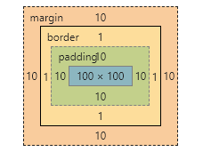
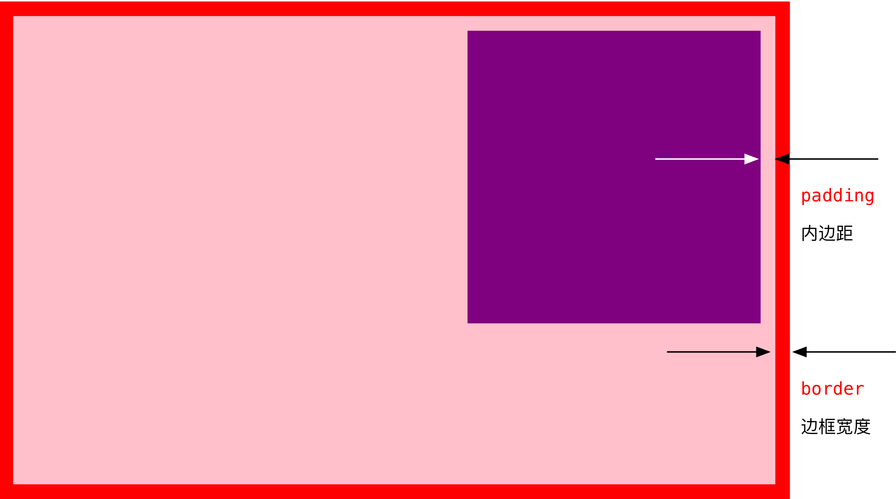

# 1. 盒子模型

## 1.1 看透网页布局的本质

-  首先利用CSS设置好盒子的大小，然后摆放盒子的位置。
-  最后把网页元素比如文字图片等等，放入盒子里面。
-  以上两步 就是网页布局的本质


## 1.2 盒子模型（Box Model）

* 盒子模型有元素的内容、边框（border）、内边距（padding）、和外边距（margin）组成。
* 盒子里面的文字和图片等元素是 内容区域
* 盒子的厚度 我们成为 盒子的边框 
* 盒子内容与边框的距离是内边距（类似单元格的 cellpadding)
* 盒子与盒子之间的距离是外边距（类似单元格的 cellspacing）
* 标准盒子模型：



## 1.3 盒子边框（border）


* 语法：

```css
border : border-width || border-style || border-color 
```

| 属性         |          作用          |
| ------------ | :--------------------: |
| border-width | 定义边框粗细，单位是px |
| border-style |       边框的样式       |
| border-color |        边框颜色        |

- 边框的样式：
  - none：没有边框即忽略所有边框的宽度（默认值）
  - solid：边框为单实线(最为常用的)
  - dashed：边框为虚线  
  - dotted：边框为点线

### 1.3.1 边框综合设置

```css
 border: 1px solid red;  没有顺序  
```

很多情况下，我们不需要指定4个边框，我们是可以单独给4个边框分别指定的。

| 上边框                     | 下边框                        | 左边框                      | 右边框                       |
| :------------------------- | :---------------------------- | :-------------------------- | :--------------------------- |
| border-top-style:样式;     | border-bottom-style:样式;     | border-left-style:样式;     | border-right-style:样式;     |
| border-top-width:宽度;     | border- bottom-width:宽度;    | border-left-width:宽度;     | border-right-width:宽度;     |
| border-top-color:颜色;     | border- bottom-color:颜色;    | border-left-color:颜色;     | border-right-color:颜色;     |
| border-top:宽度 样式 颜色; | border-bottom:宽度 样式 颜色; | border-left:宽度 样式 颜色; | border-right:宽度 样式 颜色; |

### 1.3.2 表格的细线边框


- 通过表格的`cellspacing="0"`,将单元格与单元格之间的距离设置为0，

- 但是两个单元格之间的边框会出现重叠，从而使边框变粗

- 通过css属性：

```css
table{ border-collapse:collapse; }  
```

- collapse 单词是合并的意思
- border-collapse:collapse; 表示相邻边框合并在一起。
- 如下示例：


```css
<style>
	table {
		width: 500px;
		height: 300px;
		border: 1px solid red;
	}
	td {
		border: 1px solid red;
		text-align: center;
	}
	table, td {
		border-collapse: collapse;  /*合并相邻边框*/
	}
</style>
```

## 1.4 内边距（padding）


* padding属性用于设置内边距。 **是指 边框与内容之间的距离。**
* 设置：

| 属性           | 作用     |
| -------------- | :------- |
| padding-left   | 左内边距 |
| padding-right  | 右内边距 |
| padding-top    | 上内边距 |
| padding-bottom | 下内边距 |

当我们给盒子指定padding值之后， 发生了2件事情：

1. 内容和边框 有了距离，添加了内边距。
2. 盒子会变大了。

 **注意：  后面跟几个数值表示的意思是不一样的。**

我们分开写有点麻烦，我们可以不可以简写呢？

| 值的个数 | 表达意思                                        |
| -------- | ----------------------------------------------- |
| 1个值    | padding：上下左右内边距;                        |
| 2个值    | padding: 上下内边距    左右内边距 ；            |
| 3个值    | padding：上内边距   左右内边距   下内边距；     |
| 4个值    | padding: 上内边距 右内边距 下内边距 左内边距 ； |

## 1.5 内盒尺寸计算（元素实际大小）


- 宽度

  Element Height = content height + padding + border （Height为内容高度）

- 高度

  Element Width = content width + padding + border （Width为内容宽度）

- 盒子的实际的大小 =   内容的宽度和高度 +  内边距   +  边框   

## 1.6 内边距产生的原因

* 问题


会撑大原来的盒子

- 解决：

  通过给设置了宽高的盒子，减去相应的内边距的值，维持盒子原有的大小


* padding不影响盒子大小情况

  如果没有给一个盒子指定宽度， 此时，如果给这个盒子指定padding， 则不会撑开盒子。

## 1.7 外边距

* margin属性用于设置外边距。  margin就是控制**盒子和盒子之间的距离**
* 设置：margin值的简写 （复合写法）代表意思  跟 padding 完全相同。

| 属性          | 作用     |
| ------------- | :------- |
| margin-left   | 左外边距 |
| margin-right  | 右外边距 |
| margin-top    | 上外边距 |
| margin-bottom | 下外边距 |

## 1.8 块级盒子水平居中

- 可以让一个块级盒子实现水平居中必须：
  - 盒子必须指定了宽度（width）
  - 然后就给**左右的外边距都设置为auto**，

实际工作中常用这种方式进行网页布局，示例代码如下：

```css
.header{ width:960px; margin:0 auto;}
```

常见的写法，以下下三种都可以。

* margin-left: auto;   margin-right: auto;
* margin: auto;
* margin: 0 auto;

## 1.9 文字居中和盒子居中区别

* 盒子内的文字水平居中是  text-align: center,  而且还可以让 行内元素和行内块居中对齐
* 块级盒子水平居中  左右margin 改为 auto 

```css
text-align: center; /*  文字 行内元素 行内块元素水平居中 */
margin: 10px auto;  /* 块级盒子水平居中  左右margin 改为 auto 就阔以了 上下margin都可以 */
```

## 1.10 插入图片和背景图片区别

* 插入图片 我们用的最多 比如产品展示类  移动位置只能靠盒模型 padding margin
* 背景图片我们一般用于小图标背景 或者 超大背景图片  背景图片 只能通过  background-position

```css
 img {  
		width: 200px;/* 插入图片更改大小 width 和 height */
		height: 210px;
		margin-top: 30px;  /* 插入图片更改位置 可以用margin 或padding  盒模型 */
		margin-left: 50px; /* 插入当图片也是一个盒子 */
	}

 div {
		width: 400px;
		height: 400px;
		border: 1px solid purple;
		background: #fff url(images/sun.jpg) no-repeat;
		background-position: 30px 50px; /* 背景图片更改位置 我用 background-position */
	}
```

## 1.11 清除元素的默认内外边距


为了更灵活方便地控制网页中的元素，制作网页时，我们需要将元素的默认内外边距清除

* 代码：

```css
* {
   padding:0;         /* 清除内边距 */
   margin:0;          /* 清除外边距 */
}
```

* 注意：
  * 行内元素为了照顾兼容性， 尽量只设置左右内外边距， 不要设置上下内外边距。

## 1.12 外边距合并

* 使用margin定义块元素的**垂直外边距**时，可能会出现外边距的合并。

#### (1). 相邻块元素垂直外边距的合并

- 当上下相邻的两个块元素相遇时，如果上面的元素有下外边距margin-bottom
- 下面的元素有上外边距margin-top，则他们之间的垂直间距不是margin-bottom与margin-top之和
- **取两个值中的较大者**这种现象被称为相邻块元素垂直外边距的合并（也称外边距塌陷）。


**解决方案：尽量给只给一个盒子添加margin值**。

#### (2). 嵌套块元素垂直外边距的合并（塌陷）

- 对于两个嵌套关系的块元素，如果父元素没有上内边距及边框
- 父元素的上外边距会与子元素的上外边距发生合并
- 合并后的外边距为两者中的较大者


**解决方案：**

1. 可以为父元素定义上边框。
2. 可以为父元素定义上内边距
3. 可以为父元素添加overflow:hidden。

还有其他方法，比如浮动、固定、绝对定位的盒子不会有问题，后面咱们再总结。。。

# 2. 盒子模型布局稳定性

- 学习完盒子模型，内边距和外边距，什么情况下用内边距，什么情况下用外边距？

  - 大部分情况下是可以混用的。  就是说，你用内边距也可以，用外边距也可以。 你觉得哪个方便，就用哪个。

我们根据稳定性来分，建议如下：

按照 优先使用  宽度 （width）  其次 使用内边距（padding）    再次  外边距（margin）。 

```
 width >  padding  >   margin   
```

* 原因：
  * margin 会有外边距合并 还有 ie6下面margin 加倍的bug（讨厌）所以最后使用。
  * padding  会影响盒子大小， 需要进行加减计算（麻烦） 其次使用。
  * width   没有问题（嗨皮）我们经常使用宽度剩余法 高度剩余法来做。

# 3. CSS布局的三种机制

* 网页布局的核心——就是**用 CSS 来摆放盒子**。
* CSS 提供了 **3 种机制**来设置盒子的摆放位置，分别是**普通流**（标准流）、**浮动**和**定位**，其中：
  1. **普通流**（标准流）
     - **块级元素**会独占一行，**从上向下**顺序排列；
       - 常用元素：div、hr、p、h1~h6、ul、ol、dl、form、table
     - **行内元素**会按照顺序，**从左到右**顺序排列，碰到父元素边缘则自动换行；
       - 常用元素：span、a、i、em等
  2. **浮动**
     - 让盒子从普通流中**浮**起来,主要作用让多个块级盒子一行显示。
  3. **定位**
     - 将盒子**定**在浏览器的某一个**位**置——CSS 离不开定位，特别是后面的 js 特效。

## 3.1 为什么需要浮动？

* 使用浮动的核心目的——让多个块级盒子在同一行显示。 因为这是我们最常见的一种布局方式
* 行内块（inline-block） 可以实现多个元素一行显示，但是中间会有空白缝隙
* 特点：**float** —— **浮漏特**

| 特点 | 说明                                                         |
| ---- | ------------------------------------------------------------ |
| 浮   | 加了浮动的盒子**是浮起来**的，漂浮在其他标准流盒子的上面。   |
| 漏   | 加了浮动的盒子**是不占位置的**，它原来的位置**漏给了标准流的盒子**。 |
| 特   | **特别注意**：浮动元素会改变display属性， 类似转换为了行内块，但是元素之间没有空白缝隙 |

## 3.2 什么是浮动？

* 概念：元素的浮动是指**设置了浮动属性的元素**会
  * 脱离标准普通流的控制
  * 移动到指定位置。
* 作用：
  * **让多个盒子(div)水平排列成一行**，使得浮动成为布局的重要手段。
  * 可以实现盒子的左右对齐等等..
  * 浮动最早是用来**控制图片**，实现**文字环绕图片的效果**。


* 语法：
  * 在 CSS 中，通过 `float`  中文，  浮 漏 特    属性定义浮动，语法如下：

```
选择器 { float: 属性值; }
```

| 属性值    | 描述                     |
| --------- | ------------------------ |
| **none**  | 元素不浮动（**默认值**） |
| **left**  | 元素向**左**浮动         |
| **right** | 元素向**右**浮动         |

教你学浮动口诀。通过 `float`   -----  浮 漏 特

#### 1). 浮动口诀之 浮

浮动——浮~浮~浮~~~漂浮在普通流的上面。  脱离标准流。 俗称 “脱标” 


```css
.box1 {
    width: 200px;
    height: 200px;
    background-color: rgba(255, 0, 0, 0.5);
    float: left;
}
.box2 {
    width: 150px;
    height: 300px;
    background-color: skyblue;
}
```

**小结**：

- `float` 属性会让盒子漂浮在标准流的上面，所以第二个标准流的盒子跑到浮动盒子的底下了。

#### 2).  浮动口诀之 漏

浮动——漏~漏~漏~  浮动的盒子，把自己原来的位置漏给下面标准流的盒子，就是不占有原来位置，是脱离标准流的，我们俗称 “脱标”。

```css
.box1 {
    width: 200px;
    height: 200px;
    background-color: rgba(255, 0, 0, 0.5);
    /* 让第 1 个盒子漂浮起来，不占位置 */
    float: left;
}
.box2 {
    width: 150px;
    height: 300px;
    background-color: skyblue;
}
```

所以，box2下面的其实就是跑到box1盒子下面了， 被box1给压住了，遮挡起来了

来来来，我们看个立体图


#### 3). 浮动口诀之 特

浮动——特性  float属性会改变元素display属性。

任何元素都可以浮动。浮动元素会生成一个块级框，而不论它本身是何种元素。 生成的块级框和我们前面的行内块极其相似。

体验案例——div 水平排列

```css
div {

    width: 200px;

    height: 200px;

    background-color: pink;

    /* 转换为行内块元素，可以水平显示，不过 div 之间有间隙，不方便处理 */

    /* display: inline-block; */

    /* 设置浮动属性，可以让 div 水平排列，并且没有间隙 */

    float: left;
}

.two {

    background-color: hotpink;

}
```


**注意： 浮动的元素互相贴靠一起的，但是如果父级宽度装不下这些浮动的盒子， 多出的盒子会另起一行对齐**

## 3.3 浮动(float)的应用

* #### 浮动和标准流的父盒子搭配

  我们知道，浮动是脱标的，会影响下面的标准流元素，此时，我们需要给浮动的元素添加一个标准流的父亲，这样，最大化的减小了对其他标准流的影响。

* 实际重要的导航栏中，我们不会直接用链接a 而是用 li  包含链接(li+a)的做法。

  1. li+a 语义更清晰，一看这就是有条理的列表型内容。
  2. 如果直接用a，搜索引擎容易辨别为有堆砌关键字嫌疑（故意堆砌关键字容易被搜索引擎有降权的风险），从而影响网站排名

## 3.4 浮动(float)的扩展

#### 1). 浮动元素与父盒子的关系

- 子盒子的浮动参照父盒子对齐
- 不会与父盒子的边框重叠，也不会超过父盒子的内边距



#### 2). 浮动元素与兄弟盒子的关系

在一个父级盒子中，如果**前一个兄弟盒子**是：

- **浮动**的，那么**当前盒子**会与前一个盒子的顶部对齐；
- **普通流**的，那么**当前盒子**会显示在前一个兄弟盒子的下方。 
- 浮动只会影响当前的或者是后面的标准流盒子，不会影响前面的标准流。


**建议**

**如果一个盒子里面有多个子盒子，如果其中一个盒子浮动了，其他兄弟也应该浮动。防止引起问题**

## 3.5 为什么要清除浮动

* 因为父级盒子很多情况下，不方便给高度，但是子盒子浮动就不占有位置，最后父级盒子高度为0，就影响了下面的标准流盒子。


* 总结：
  * 由于浮动元素不再占用原文档流的位置，所以它会对后面的元素排版产生影响
  * 准确地说，并不是清除浮动，而是**清除浮动后造成的影响**

## 3.6 清除浮动本质

* **清除浮动主要为了解决父级元素因为子级浮动引起内部高度为0 的问题。清除浮动之后， 父级就会根据浮动的子盒子自动检测高度。父级有了高度，就不会影响下面的标准流了**

## 3.7 清除浮动的方法

在CSS中，clear属性用于清除浮动，在这里，我们先记住清除浮动的方法，具体的原理，等我们学完css会再回头分析。

- 语法：

```
选择器{clear:属性值;}   clear 清除  
```

| 属性值 | 描述                                       |
| ------ | ------------------------------------------ |
| left   | 不允许左侧有浮动元素（清除左侧浮动的影响） |
| right  | 不允许右侧有浮动元素（清除右侧浮动的影响） |
| both   | 同时清除左右两侧浮动的影响                 |

但是我们实际工作中， 几乎只用 clear: both;

#### 1).额外标签法(隔墙法)

```
是W3C推荐的做法是通过在浮动元素末尾添加一个空的标签例如 <div style=”clear:both”></div>，或则其他标签br等亦可。
```

- 优点： 通俗易懂，书写方便
- 缺点： 添加许多无意义的标签，结构化较差。

#### 2).父级添加overflow属性方法

```
可以给父级添加： overflow为 hidden| auto| scroll  都可以实现。
```

优点：  代码简洁

缺点：  内容增多时候容易造成不会自动换行导致内容被隐藏掉，无法显示需要溢出的元素。

#### 3).使用after伪元素清除浮动

**:after 方式为空元素额外标签法的升级版，好处是不用单独加标签了** 

使用方法：

```
 .clearfix:after {  content: ""; display: block; height: 0; clear: both; visibility: hidden;  }   

 .clearfix {*zoom: 1;}   /* IE6、7 专有 */
```

- 优点： 符合闭合浮动思想  结构语义化正确
- 缺点： 由于IE6-7不支持:after，使用 zoom:1触发 hasLayout。
- 代表网站： 百度、淘宝网、网易等


#### 4).使用双伪元素清除浮动

使用方法：

```
.clearfix:before,.clearfix:after { 
  content:"";
  display:table; 
}
.clearfix:after {
 clear:both;
}
.clearfix {
  *zoom:1;
}
```

- 优点：  代码更简洁

- 缺点：  由于IE6-7不支持:after，使用 zoom:1触发 hasLayout。

- 代表网站： 小米、腾讯等

## 3.8 清除浮动总结

1. 父级没高度
2. 子盒子浮动了
3. 影响下面布局了，我们就应该清除浮动了。

| 清除浮动的方式       | 优点               | 缺点                               |
| -------------------- | :----------------- | :--------------------------------- |
| 额外标签法（隔墙法） | 通俗易懂，书写方便 | 添加许多无意义的标签，结构化较差。 |
| 父级overflow:hidden; | 书写简单           | 溢出隐藏                           |
| 父级after伪元素      | 结构语义化正确     | 由于IE6-7不支持:after，兼容性问题  |
| 父级双伪元素         | 结构语义化正确     | 由于IE6-7不支持:after，兼容性问题  |

后面两种伪元素清除浮动，大家暂且会使用就好， 深入原理，我们后面学完伪元素再讲。

