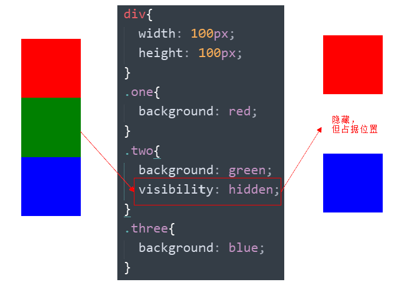

# 1. 元素的显示与隐藏

- 目的

  让一个元素在页面中消失或者显示出来

- 场景

  类似网站广告，当我们点击关闭就不见了，但是我们重新刷新页面，会重新出现！

## 1.1 display 显示（重点）

- display 设置或检索对象是否及如何显示。

```
display: none 隐藏对象
display：block 除了转换为块级元素之外，同时还有显示元素的意思。
```

* 特点： 隐藏之后，不再保留位置。


* 实际开发场景：配合后面js做特效，比如下拉菜单，原先没有，鼠标经过，显示下拉菜单， 应用极为广泛

## 1.2 visibility 可见性 (了解)

- 设置或检索是否显示对象。

```
visibility：visible; 　对象可视
visibility：hidden; 　  对象隐藏
```

* 特点： 隐藏之后，继续保留原有位置。（停职留薪）

