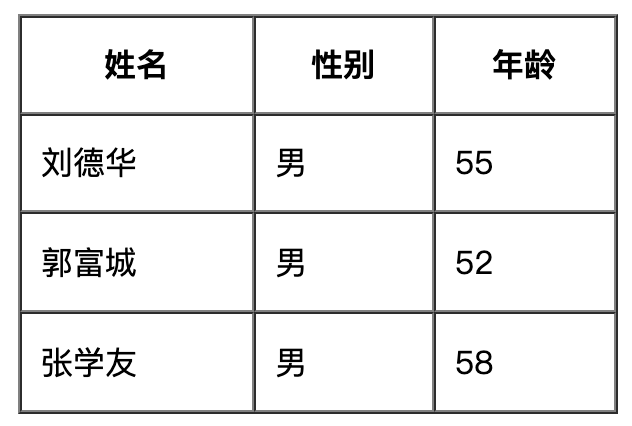
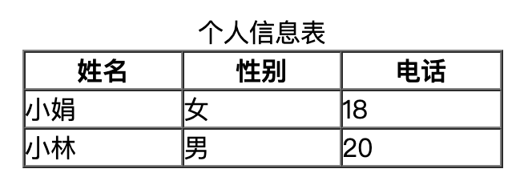
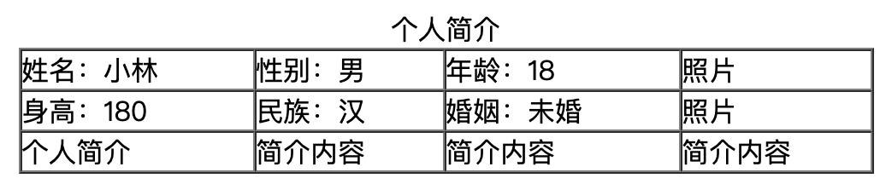
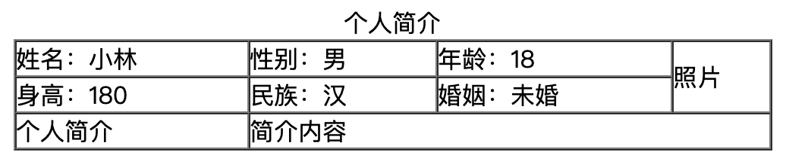
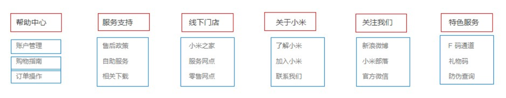
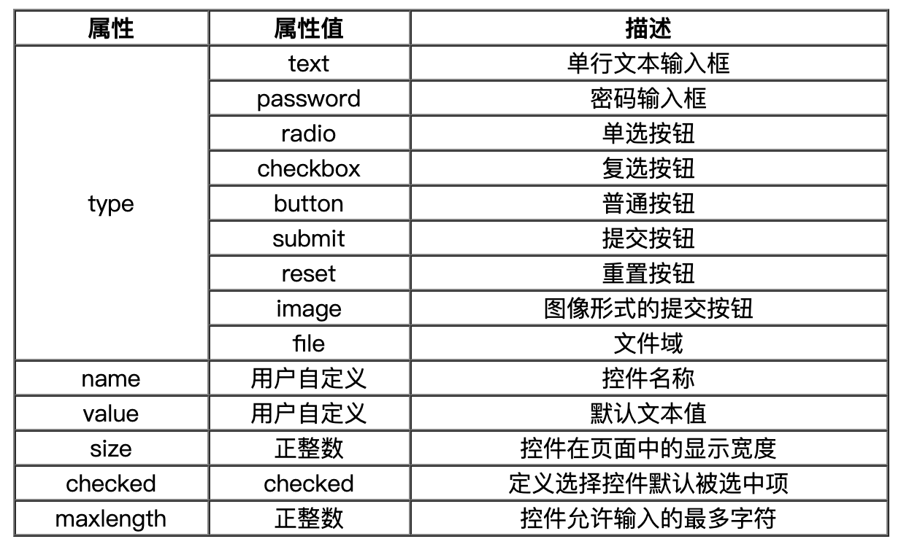
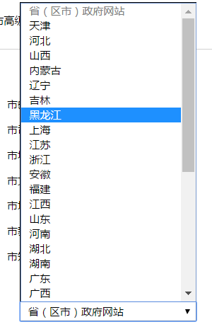

# 1. 简介

* 表格：用来**展示数据**，可以让数据显示整齐规范
* 列表：用来**布局**，可以使页面布局整齐规范
* 表单：用来**收集用户信息**

## 1.1 查文档

W3C : http://www.w3school.com.cn/

MDN: https://developer.mozilla.org/zh-CN/

# 2. 表格

| 标签名             | 定义           | 说明                                         |
| ------------------ | :------------- | :------------------------------------------- |
| table              | 表格标签       | 就是一个四方的盒子                           |
| tr                 | 表格行标签     | 行标签要再table标签内部才有意义              |
| td                 | 单元格标签     | 单元格标签是个容器级元素，可以放任何东西     |
| th                 | 表头单元格标签 | 它还是一个单元格，但是里面的文字会居中且加粗 |
| caption            | 表格标题标签   | 表格的标题，跟着表格一起走，和表格居中对齐   |
| colspan 和 rowspan | 合并属性       | 用来合并单元格的                             |

* 表格提供了HTML 中定义表格式数据的方法。
* 表格中由行中的单元格组成。
* 表格中没有列元素，列的个数取决于行的单元格个数。
* 表格不要纠结于外观，那是CSS 的作用。

* 简单示例

```html
<table>
	<caption>标题</caption>
	<tr>
    <th>表头</th>
    ...
  </tr>
  <tr>
    <td>单元格内容</td>
    ...
  </tr>
  ...
</table>
```

## 2.1 表格属性

| 属性名      | 含义                                     | 常用属性值            |
| ----------- | ---------------------------------------- | --------------------- |
| border      | 设置表格的边框（默认border=“0”无边框）   | 像素值                |
| cellspacing | 设置单元格与单元格边框之间的空白间距     | 像素值（默认为2像素） |
| cellpadding | 设置单元格内容与单元格边框之间的空白间距 | 像素值（默认为1像素） |
| width       | 设置表格的宽度                           | 像素值                |
| height      | 设置表格的高度                           | 像素值                |
| align       | 设置表格在网页中的水平对齐方式           | left、center、right   |


* 示例



```html
<table width="300" height="200" border="1" cellpadding="10" cellspacing="0" align="center">
    <tr>
        <th>姓名</th>
        <th>性别</th>
        <th>年龄</th>
    </tr>
    <tr>
        <td>刘德华</td>
        <td>男</td>
        <td>55</td>
    </tr>
    <tr>
        <td>郭富城</td>
        <td>男</td>
        <td>52</td>
    </tr>
    <tr>
        <td>张学友</td>
        <td>男</td>
        <td>58</td>
    </tr>
</table>
```

## 2.2 表头及标题

* 表头
  * 一般表头单元格位于表格的第一行或第一列，并且文本加粗居中
  * 只需用表头标签&lt;th></th&gt;替代相应的单元格标签&lt;td&gt;</td&gt;即可

* 标题
  * caption 元素定义**表格标题**，通常这个标题会被居中且显示于表格之上。
  * caption 标签必须紧随 table 标签之后。
  * 这个标签只存在 表格里面才有意义。
* 示例



```html
<table width="300" border="1" align="center" cellspacing="0" cellpadding="0">
    <caption>个人信息表</caption>
    <tr>
        <th>姓名</th>
        <th>性别</th>
        <th>电话</th>
    </tr>
    <tr>
        <td>小娟</td>
        <td>女</td>
        <td>18</td>
    </tr>
    <tr>
        <td>小林</td>
        <td>男</td>
        <td>20</td>
    </tr>
</table>
```

## 2.3 合并单元格

* 跨行合并：rowspan="合并单元格的个数"      
* 跨列合并：colspan="合并单元格的个数"
* 合并单元格步骤：
  1. 先确定是跨行还是跨列合并
  2. 根据 “先上 后下 先左 后右” 的原则找到目标单元格，然后写上 合并方式 还有 要合并的单元格数量  比如 ： <td colspan="3">   </td>
  3. 删除多余的单元格

* 示例：将重复内容合并



```html
<table width="500" border="1" align="center" cellspacing="0" cellpadding="0">
    <caption>个人简介</caption>
    <tr>
        <td>姓名：小林</td>
        <td>性别：男</td>
        <td>年龄：18</td>
        <td>照片</td>
    </tr>
    <tr>
        <td>身高：180</td>
        <td>民族：汉</td>
        <td>婚姻：未婚</td>
        <td>照片</td>
    </tr>
    <tr>
        <td>个人简介</td>
        <td>简介内容</td>
        <td>简介内容</td>
        <td>简介内容</td>
    </tr>
</table>
```



```html
<table width="500" border="1" align="center" cellspacing="0" cellpadding="0">
    <caption>个人简介</caption>
    <tr>
        <td>姓名：小林</td>
        <td>性别：男</td>
        <td>年龄：18</td>
        <td rowspan="2">照片</td>
    </tr>
    <tr>
        <td>身高：180</td>
        <td>民族：汉</td>
        <td>婚姻：未婚</td>
    </tr>
    <tr>
        <td>个人简介</td>
        <td colspan="3">简介内容</td>
    </tr>
</table>
```

## 2.4 扩展

### 表格划分结构（了解）

对于比较复杂的表格，表格的结构也就相对的复杂了，所以又将表格分割成三个部分：题头、正文和脚注。而这三部分分别用:thead,tbody,tfoot来标注， 这样更好的分清表格结构

**注意：**

1. thead：用于定义表格的头部。用来放标题之类的东西。thead 内部必须拥有 tr 标签！
2. tbody：用于定义表格的主体。放数据本体 。
3. tfoot：放表格的脚注之类。
4. 以上标签都是放到table标签中。

# 3. 列表

* 容器里面装载着结构，样式一致的文字或图表的一种形式，叫列表
* 列表最大的特点就是  整齐 、整洁、 有序，跟表格类似，但是他可组合自由度会更高

| 标签名 |     定义     | 说明                                                   |
| ------ | :----------: | :----------------------------------------------------- |
| ul     | **无序标签** | 里面只能包含li    没有顺序，我们以后布局中最常用的列表 |
| ol     |   有序标签   | 里面只能包含li    有顺序， 使用情况较少                |
| dl     |  自定义列表  | 里面有2个兄弟， dt 和 dd                               |

## 3.1 无序列表（常用）

* 无序列表的各个列表项之间没有顺序级别之分，是并列的。其基本语法格式如下：

```html
<ul>
    <li>列表项1</li>
    <li>列表项2</li>
    <li>列表项3</li>
    ......
</ul>
```

* ul标签中只能嵌套li标签，直接在ul标签中输入其他标签或者文字的做法是不被允许的。
* li标签之间相当于一个容易，可以容纳所有元素
* 无序列表会带有自己样式属性，放下那个样式，一会让CSS来

## 3.2 有序列表

* 有序列表即为有排列顺序的列表，其各个列表项按照一定的顺序排列定义，有序列表的基本语法格式如下：

```html
<ol>
    <li>列表项1</li>
    <li>列表项2</li>
    <li>列表项3</li>
    ......
</ol>
```

## 3.3 自定义列表

* 定义列表常用于对术语或名词进行解释和描述，定义列表的列表项前没有任何项目符号。其基本语法如下：

```html
<dl>
    <dt>名词1</dt>
    <dd>名词1解释1</dd>
    <dd>名词1解释2</dd>
    ...
    <dt>名词2</dt>
    <dd>名词2解释1</dd>
    <dd>名词2解释2</dd>
    ...
</dl>
```

多用于：



# 4. 表单标签

* 在HTML中，一个完整的表单通常由表单控件（也称为表单元素）、提示信息和表单域3个部分构成。


* 表单控件：包含了具体的表单功能项，如单行文本输入框、密码输入框、复选框、提交按钮、重置按钮等。
* 提示信息：一个表单中通常还需要包含一些说明性的文字，提示用户进行填写和操作。
* 表单域：他相当于一个容器，用来容纳所有的表单控件和提示信息，可以通过他定义处理表单数据所用程序的url地址，以及数据提交到服务器的方法。如果不定义表单域，表单中的数据就无法传送到后台服务器。

## 4.1 input控件

```html
<input type="属性值" value="你好">
```



* type属性
  * 这个属性通过改变值，可以决定了你属于那种input表单。
  * 比如 type = 'text'  就表示 文本框 可以做 用户名， 昵称等。
  * 比如 type = 'password'  就是表示密码框   用户输入的内容 是不可见的。
* value属性   
  * value 默认的文本值。 有些表单想刚打开页面就默认显示几个文字，就可以通过这个value 来设置。
* name属性
  * name表单的名字， 这样，后台可以通过这个name属性找到这个表单。  页面中的表单很多，name主要作用就是用于区别不同的表单。
  * name属性后面的值，是我们自己定义的。
* checked属性
  * 表示默认选中状态。  较常见于 单选按钮和复选按钮。

## 4.2 label标签

* 目标：label标签主要目的是为了提高用户体验。 为用户提高最优秀的服务。

* 概念：label 标签为 input 元素定义标注（标签）。

* 作用：用于绑定一个表单元素, 当点击label标签的时候, 被绑定的表单元素就会获得输入焦点。

  

* 使用方法有两种，如下：

  1. 第一种用法就是用label直接包括input表单。

  ```html
  <label> 用户名： <input type="radio" name="usename" value="请输入用户名">   </label>
  ```

  2. 第二种用法 for 属性规定 label 与哪个表单元素绑定。

  ```html
  <label for="man">男</label>
  <input type="radio" name="sex" id="man">
  <label for="woman">女</label>
  <input type="radio" name="sex" id="woman">
  ```

## 4.3 textarea控件（文本域）

* 语法：

```html
<textarea>文本内容</textarea>
```

* 作用：通过textarea控件可以轻松地创建多行文本输入框.

  cols="每行中的字符数" rows="显示的行数"  我们实际开发不用

* 文本框和文本域区别：

|       表单        |  名称  |       区别       |         默认值显示          |       用于场景       |
| :---------------: | :----: | :--------------: | :-------------------------: | :------------------: |
| input type="text" | 文本框 | 只能显示一行文本 | 单标签，通过value显示默认值 | 用户名、昵称、密码等 |
|     textarea      | 文本域 | 可以显示多行文本 | 双标签，默认值写到标签中间  |        留言板        |

## 4.4 select下拉列表



* 语法

```html
<select>
    <option>选项1</option>
    <option>选项2</option>
    <option>选项3</option>
    ...
</select>
```

* 注意：

1. &lt;select&gt;  中至少包含一对 option 
2. 在option 中定义selected =" selected "时，当前项即为默认选中项。
3. 但是我们实际开发会用的比较少

## 4.5 form表单域

- 收集的用户信息怎么传递给服务器？

  通过form表单域

- 目的：

  在HTML中，form标签被用于定义表单域，以实现用户信息的收集和传递，form中的所有内容都会被提交给服务器。

* 语法: 

```html
<form action="url地址" method="提交方式" name="表单名称">
  各种表单控件
</form>
```

**常用属性：**

| 属性   | 属性值   | 作用                                               |
| ------ | :------- | -------------------------------------------------- |
| action | url地址  | 用于指定接收并处理表单数据的服务器程序的url地址。  |
| method | get/post | 用于设置表单数据的提交方式，其取值为get或post。    |
| name   | 名称     | 用于指定表单的名称，以区分同一个页面中的多个表单。 |

