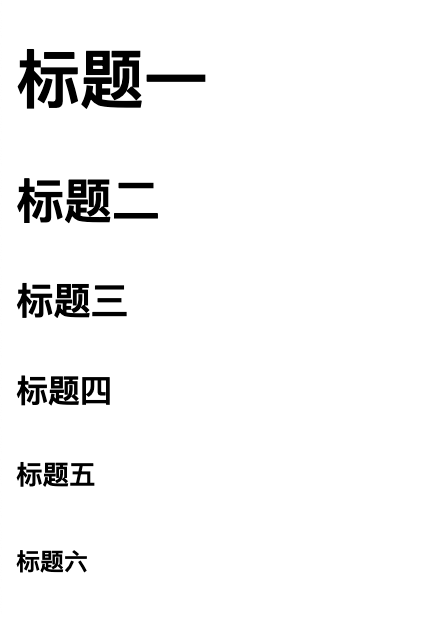
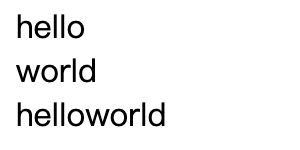
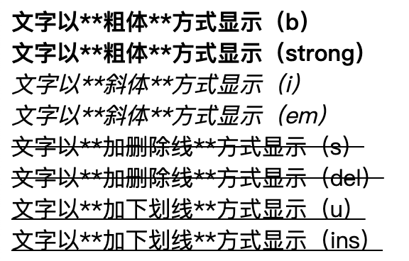

# 1. HTML初识

* HTML指的是超文本标记语言（**H**yper **T**ext **M**arkup **L**anguage）是用来描述网页的一种语言。
* HTML不是一种编程语言，而是一种标记语言 (markup language)
* 标记语言是一套标记标签 (markup tag)

**所谓超文本，有2层含义：**

1. 因为它可以加入图片、声音、动画、多媒体等内容（超过文本限制）
2. 不仅如此，它还可以从一个文件跳转到另一个文件，与世界各地主机的文件连接（超级链接文本）。

**注：**网页是由网页元素组成的，这些元素是利用html标签描述出来，然后通过浏览器解析，就可以显示给用户了。

## 1.1 HTML骨架格式

```html
<!DOCTYPE html>
<html lang="zh-CN">
<head>
    <meta charset="UTF-8">
    <title>html</title>
</head>
<body>
</body>
</html>
```

* 上述代码块可以看作是html骨架的初始模板，以下则是对上述具体说明：


## 1.2 文档类型 <!DOCTYPE>

* 用法：

  ```
  <!DOCTYPE html>
  ```

* 作用：声明位于文档中的最前面的位置，处于  标签之前。此标签可告知浏览器文档使用哪种 HTML 或 XHTML 规范。
* 注意：一些老网站可能用的还是老版本的文档类型比如 XHTML之类的，但是我们学的是HTML5,而且HTML5的文档类型兼容很好(向下兼容的原则)，所以大家放心的使用HTML5的文档类型就好了。

## 1.3 页面语言lang

* 用法：（指定html 语言种类）

```html
<html lang="en"> <!-- 定义语言为英语 --> 
<html lang="zh-CN"> <!-- 定义语言为中文，考虑浏览器和操作系统的兼容性，此类型最常使用 --> 
```

* 意义：简单来说，可能对于程序来说没有太大的作用，但是它可以告诉浏览器，搜索引擎，一些处理Html的程序对页面语言内容来做一些对应的处理或者事情。
  比如可以
  - 根据根据lang属性来设定不同语言的css样式，或者字体
  - 告诉搜索引擎做精确的识别
  - 让语法检查程序做语言识别
  - 帮助翻译工具做识别
  - 帮助网页阅读程序做识别

## 1.4 字符集

```html
<meta charset="UTF-8" />
```

计算机要准确的处理各种字符集文字，需要进行字符编码，以便计算机能够识别和存储各种文字。

utf-8是目前最常用的字符集编码方式，常用的字符集编码方式还有gbk和gb2312。

* gb2312 简单中文  包括6763个汉字
* BIG5   繁体中文 港澳台等用
* GBK包含全部中文字符    是GB2312的扩展，加入对繁体字的支持，兼容GB2312
* UTF-8则基本包含全世界所有国家需要用到的字符
* **这句代码非常关键， 是必须要写的代码，否则可能引起乱码的情况。**

# 2. 常用标签

* 这里主要介绍一些常用的标签，后续有需要的可直接查询手册之类的就行

## 2.1 标题标签

```html
<h1>标题一</h1>
<h2>标题二</h2>
<h3>标题三</h3>
<h4>标题四</h4>
<h5>标题五</h5>
<h6>标题六</h6>
```

* 效果图：



* 作用：作为标题使用，并且依据重要性递减

## 2.2 段落标签

```
<p>文本内容</p>
```

* 作用：简单可以理解为把 HTML 文档分割为若干段落，文本在一个段落中会根据浏览器窗口的大小自动换行。

## 2.3 水平线标签

```
<hr/>
```

* 作用：创建横跨网页水平线的标签，简单说一条横线

## 2.4 换行标签

```
<br/>
```

* 作用：在HTML中，一个段落中的文字会从左到右依次排列，直到浏览器窗口的右端，然后自动换行。如果希望某段文本强制换行显示，就需要使用换行标签

## 2.5 div和span标签

```
<div>hello</div>
<div>world</div>
<span>hello</span><span>world</span>
```

* 效果图：



* 作用：div span 是没有语义的，是我们网页布局主要的两个盒子，区别如上图，**一个div占用一整行，span则一行可以多个**

## 2.6 文本格式化标签

| 标签名      | 定义                                           |
| ----------- | :--------------------------------------------- |
| b 和 strong | 文字以**粗体**方式显示（XHTML推荐使用strong）  |
| i 和 em     | 文字以**斜体**方式显示（XHTML推荐使用em）      |
| s 和 del    | 文字以**加删除线**方式显示（XHTML推荐使用del） |
| u 和 ins    | 文字以**加下划线**方式显示（XHTML推荐使用ins） |

```html
<b>文字以**粗体**方式显示（b）</b><br/>
<strong>文字以**粗体**方式显示（strong）</strong><br/>
<i>文字以**斜体**方式显示（i）</i><br/>
<em>文字以**斜体**方式显示（em）</em><br/>
<s>文字以**加删除线**方式显示（s）</s><br/>
<del>文字以**加删除线**方式显示（del）</del><br/>
<u>文字以**加下划线**方式显示（u）</u><br/>
<ins>文字以**加下划线**方式显示（ins）</ins><br/>
```

* 效果图：



* 区别：b 只是加粗， strong 除了加粗还有强调的意思，语义更强烈；剩下的同理...

## 2.7 标签属性

* 使用HTML制作网页时，如果想让HTML标签提供更多的信息，可以使用HTML标签的属性加以设置。其基本语法格式如下：

```
<标签名 属性1="属性值1" 属性2="属性值2" …> 内容 </标签名>
<手机 颜色="红色" 大小="5寸">  </手机>
```

## 2.8 图像标签

* 顾名思义，就是显示图像文件，具体属性值查看下表

| 属性   | 属性值                         | 描述                     |
| ------ | ------------------------------ | ------------------------ |
| src    | URL                            | 图像的路径               |
| alt    | 文本                           | 图像不能显示时的替换文本 |
| title  | 文本                           | 鼠标悬停时显示的内容     |
| width  | 像素（XHTML不支持%页面百分比） | 设置图像的宽度           |
| height | 像素（XHTML不支持%页面百分比） | 设置图像的高度           |
| border | 数字                           | 设置图像边框的宽度       |

**注意: **

1. 标签可以拥有多个属性，必须写在开始标签中，位于标签名后面。
2. 属性之间不分先后顺序，标签名与属性、属性与属性之间均以空格分开。
3. 任何标签的属性都有默认值，省略该属性则取默认值。
4. 采取  键值对 的格式   key="value"  的格式

* 如下示例

```
正常的<br/>
<br/>
带有边框的<br/>
<br/>
有提示文本的<br />
<br/>
有替换文本的<br />

```

## 2.9 链接标签

```
<a href="跳转目标" target="目标窗口的弹出方式">文本或图像</a>
```

| 属性   | 作用                                                         |
| ------ | :----------------------------------------------------------- |
| href   | 用于指定链接目标的url地址，（必须属性）当为标签应用href属性时，它就具有了超链接的功能 |
| target | 用于指定链接页面的打开方式，其取值有_self和_blank两种，其中_self为默认值，_blank为在新窗口中打开方式。 |

**注意：**

1. 外部链接 需要添加 http:// www.baidu.com
2. 内部链接 直接链接内部页面名称即可 比如 < a href="index.html"> 首页 </a >
3. 如果当时没有确定链接目标时，通常将链接标签的href属性值定义为“#”(即href="#")，表示该链接暂时为一个空链接。
4. 不仅可以创建文本超链接，在网页中各种网页元素，如图像、表格、音频、视频等都可以添加超链接。

## 2.10 锚点定位

* 通过创建锚点链接，用户能够快速定位到目标内容

```
1. 使用相应的id名标注跳转目标的位置。 (找目标)
  <h3 id="two">第2集</h3> 

2. 使用<a href="#id名">链接文本</a>创建链接文本（被点击的） （拉关系）  我也有一个姓毕的姥爷..
  <a href="#two">  
```

## 2.11 base标签

```
<base target="_blank"/>
```

* base 可以设置整体链接的打开状态 
* base 写到  <head>  </head>  之间
* 把所有的连接 都默认添加 target="_blank"

## 2.12 注释标签

```
<!-- 注释语句 -->
```

* 注释内容不会显示在浏览器窗口中，但是作为HTML文档内容的一部分，也会被下载到用户的计算机上，查看源代码时就可以看到

## 2.13 特殊字符

* 一些特殊的符号，我们再html 里面很难或者 不方便直接 使用， 我们此时可以使用下面的替代代码。
* 是以**运算符**`&`开头,以**分号运算符**`;`结尾。
* 他们不是标签，而是符号。
* HTML 中不能使用小于号 “<” 和大于号 “>”特殊字符，浏览器会将它们作为标签解析，若要正确显示，在 HTML 源代码中使用字符实体


# 3. XHTML与HTML的区别？

- XHTML 指的是可扩展超文本标记语言
- XHTML 与 HTML 4.01 几乎是相同的
- XHTML 是更严格更纯净的 HTML 版本
- XHTML 是以 XML 应用的方式定义的 HTML
- XHTML 是 2001 年 1 月发布的 W3C 推荐标准
- XHTML 得到所有主流浏览器的支持
- XHTML 元素是以 XML 格式编写的 HTML 元素。XHTML是严格版本的HTML，例如它要求标签必须小写，标签必须被正确关闭，标签顺序必须正确排列，对于属性都必须使用双引号等。

# 4. 路径

* 一般我们会把项目放在一个文件夹中，这文件夹也就是“目录文件夹”，打开这目录文件夹第一层，就是我们所讲的“根目录”；一般根目录下也会用新的文件夹存放图片资源、js资源等，这样就要涉及到路径的读取。路径可以分为：相对路径和绝对路径

## 4.1 相对路径

* 以引用文件之网页所在位置为参考基础，而建立出的目录路径。因此，当保存于不同目录的网页引用同一个文件时，所使用的路径将不相同，故称之为相对路径。
* 相对路径，是从代码所在的这个文件出发， 去寻找我们的目标文件的，而 我们所说的 上一级 下一级 同一级  简单说，就是 图片 位于 HTML 页面的位置。


| 路径分类   | 符号  | 说明                                                         |
| ---------- | :---: | :----------------------------------------------------------- |
| 同一级路径 |       | 只需输入图像文件的名称即可，如&lt;img src="baidu.gif" /&gt;。 |
| 下一级路径 |  “/”  | 图像文件位于HTML文件同级文件夹下（例如文件夹名称为：images）                         如&lt;img src="images/baidu.gif" /&gt;。   |
| 上一级路径 | “../” | 在文件名之前加入“../” ，如果是上两级，则需要使用 “../ ../”，以此类推，                    如&lt;img src="../baidu.gif" /&gt;。  |

## 4.2 绝对路径

* 绝对路径以Web站点根目录为参考基础的目录路径。之所以称为绝对，意指当所有网页引用同一个文件时，所使用的路径都是一样的。
* “D:\web\img\logo.gif”，或完整的网络地址，例如“http://www.itcast.cn/images/logo.gif”。

* **注意：**绝对路径用的较少，我们理解下就可以了。  但是要注意，它的写法 特别是符号  \  并不是 相对路径的   /    

