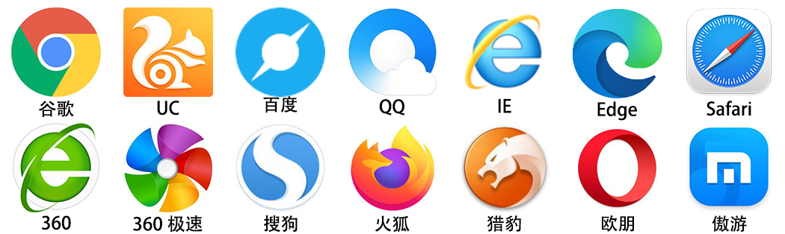

# 1. 认识网页

* 网页主要由文字、图像和超链接等元素构成。当然，除了这些元素，网页中还可以包含音频、视频以及Flash等。

# 2. 浏览器

* 浏览器是网页显示、运行的平台，常见的浏览器有如下：

  

* 查看浏览器占有的市场份额：[点击查看](https://tongji.baidu.com/research/site)

* 常见浏览器内核（了解）

  浏览器内核包括两部分，渲染引擎和js引擎。渲染引擎负责读取网页内容，整理讯息，计算网页的显示方式并显示页面，js引擎是解析执行js获取网页的动态效果。后来JS引擎越来越独立，内核就倾向于只指渲染引擎。

| 内核 | 开发公司 | 浏览器 |
| :----: | :---- | :---- |
| Trident | 微软公司 | IE、360浏览器、猎豹浏览器、傲游浏览器、2345浏览器、百度浏览器、世界之窗浏览器、瑞星浏览器、淘宝浏览器、腾讯TT浏览器等 |
| Gecko | Mozilla组织 | Firefox火狐浏览器 |
| Webkit | 苹果公司 | Safari、360极速浏览器、chrome高速模式、搜狗高速浏览器 |
| Chromium | 谷歌公司 | Chrome谷歌、Edge、UC |
| Blink | 由谷歌和Opera Softwware联合开发 | Opera欧朋（15及以后版本）、Chrome（28及以后版本）|

  **注：**我们主要关注IE、火狐、Safari、chrome谷歌、opera欧朋 等浏览器

  **扩展**

  移动端的浏览器内核主要说的是系统内置浏览器的内核：

  Android手机，使用率最高的就是Webkit内核，大部分国产浏览器宣称的自己的内核，基本上都是基于webkit二次开发。

  IOS以及WP7平台上，由于系统原因，系统大部分自带浏览器内核，一般是Safari或者IE内核Trident的。

# 3. Web标准

* W3C是什么？

  Web标准不是某一个标准，而是由W3C组织和其他标准化组织制定的一系列标准的集合。

  W3C 万维网联盟是国际最著名的标准化组织。1994年成立后，至今已发布近百项相关万维网的标准，对万维网发展做出了杰出的贡献。

  w3c就类似于现实世界中的联合国。

* 为什么要遵循WEB标准呢？

  通过以上浏览器不同内核不同，我们知道他们显示页面或者排版就有些许差异。

  

* Web标准的好处？

  遵循web标准可以让不同我们写的页面更标准更统一外，还有许多优点

  *1*、让Web的发展前景更广阔 
  *2*、内容能被更广泛的设备访问
  *3*、更容易被搜寻引擎搜索
  *4*、降低网站流量费用
  *5*、使网站更易于维护
  *6*、提高页面浏览速度

* Web标准的构成？

  **构成：** 主要包括结构（Structure）、表现（Presentation）和行为（Behavior）三个方面。

  * 结构标准：结构用于对网页元素进行整理和分类，这里主要指HTML。
  * 表现标准：表现用于设置网页元素的版式、颜色、大小等外观样式，这里主要指CSS。
  * 行为标准：行为是指网页模型的定义和交互的编写，这里主要指Javascript。

